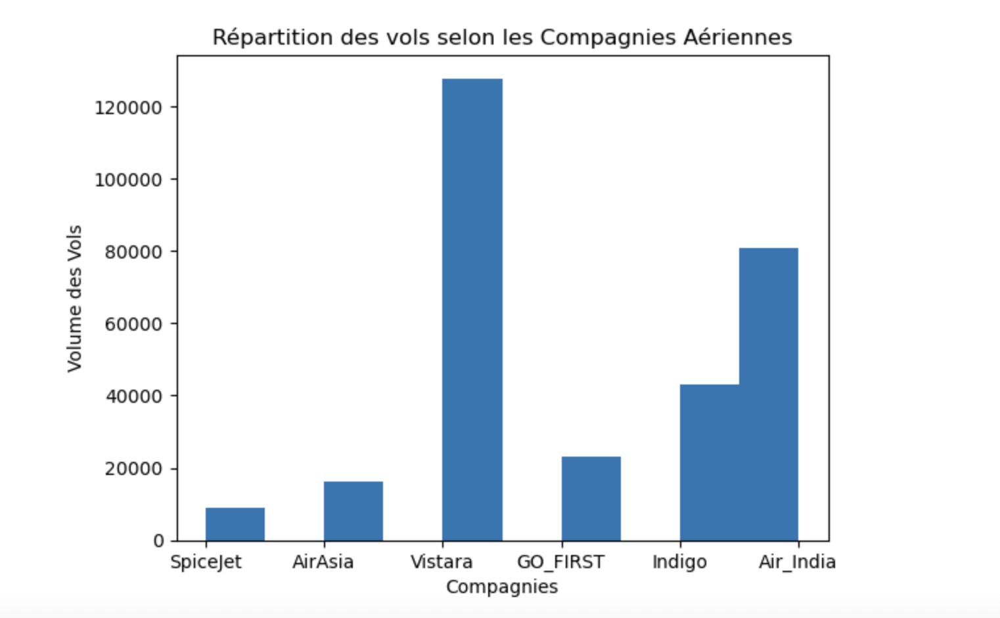

# Python – Bases de l’Analyse Exploratoire (EDA)

## 🎯 Contexte
Ce projet a pour objectif de présenter les étapes fondamentales de l’analyse exploratoire des données (Exploratory Data Analysis, EDA) avec Python.  
Il ne s’agit pas d’une analyse métier des vols, mais d’un **notebook pédagogique** servant de mémo pour réviser et illustrer les bonnes pratiques de l’EDA.

---

## 🗂 Objectifs
- Charger et explorer un dataset avec Pandas.
- Obtenir un aperçu statistique des variables numériques.
- Vérifier la qualité des données (valeurs manquantes, doublons, types de colonnes).
- Nettoyer les colonnes inutiles et préparer les données.
- Réaliser quelques visualisations simples pour identifier les premières tendances.

---

## 🔎 Étapes principales
1. **Import des librairies nécessaires** (Pandas, Numpy, Matplotlib, Seaborn).
2. **Chargement et aperçu du dataset** avec `df.head()`.
3. **Résumé statistique** avec `df.describe()`.
4. **Nettoyage des données** (suppression d’une colonne inutile, vérification des valeurs manquantes).
5. **Analyse des types de variables** (`df.dtypes`).
6. **Premières visualisations** : histogrammes et distributions.

---

## 🛠️ Technologies utilisées
- Python 3
- Pandas
- Numpy
- Matplotlib
- Seaborn
- Jupyter Notebook

---

## 📊 Exemple de sortie
Un histogramme illustrant la répartition du volume des vols par compagnie aérienne :

